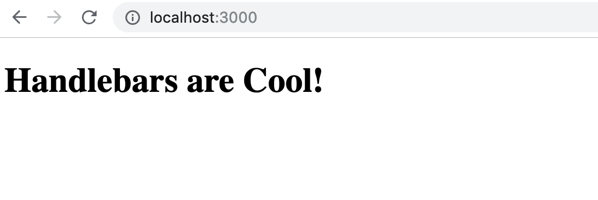

You might know the website [EventBrite](https://eventbrite.com). It is a site where people can find great events to attend. In this tutorial you are going to build **Make Parties** - your very own event website.


# Prerequisites

Before starting this tutorial you should be familiar with the following topics:

- HTML/CSS & Bootstrap
- JavaScript Fundamentals

# Learning Outcomes

By the end of this tutorial, you should be able to...

1. Build a web app using Node.js and Handlebars
1. Implement the internet-wide paradigms of RESTful and Resourceful routing
1. Create, Read, Update, and Delete (CRUD) a single `Event` resource
1. Create and delete an additional resource (`Rsvp`), and associate it to another resource
1. Use a SQL document-based database with an Object Document Mapper (Sequelize).

# How to Plan a Coding Project: User Stories

Before we get started, let's make a plan for what **User Stories** we're going to build. Then we'll jump in and start Express.js app and add a templating engine.

Software development these days is organized into **Agile Sprints** that are usually two weeks long. You'll notice evidence of this if you ever update your apps and read the update text. Sometimes it just says:

```
We ship a new version every two weeks...
```

That's because they are organizing their engineering in this standard agile way.

During each sprint developers pick a few **User Stories** to build, test, and ship to production. A **User Story** is one chunk of functionality. Engineers use the term **User Story** instead of "feature" to emphasize the user's experience in their design, development and testing. This emphasis on the user is called **User Centered Development**. Whenever you build anything on a team or by yourself, always use a **Backlog** of **User Stories** to organize and prioritize what you will build and when.

It is a good habit to build applications one resource at a time, adding all the **Resourceful Routes** for each resource before moving to the next.

So the user stories we can have for this event app will be as follows:

1. Users can view all events (index)
1. Users can create a event (new/create)
1. Users can view one event (show)
1. Users can edit a event (edit/update)
1. Users can delete a event (destroy)

Once we have this single Event resource build, we can move onto making an associated RSVP resource.

1. Users can rsvp to events (/rsvps/create, /rsvps/new)
1. Users can cancel their rsvp (/rsvps/destroy)

As we finish our user stories we'll be committing to GitHub 🐙.

# Getting Started - Cloud9

**(Ignore this section if you are installing the development environment on your own computer)**

Now that we have some user stories, let's initialize an Express.js project so we can start on the first user story in the next chapter of this tutorial.

> [action]
>
> If you are using Cloud9
>
> 1. Select "Create a New Workspace"
> 1. Name your project 'make-parties'
> 1. At the bottom select a HTML5 template
> 1. Delete the hello-world file.
> 1. You are good to go!

# Getting Started - Setting up your Computer

**(Ignore this section if you are using Cloud9)**

For reference for the rest of this chapter you can look at [ExpressJS's Getting Started](https://expressjs.com/en/starter/installing.html) docs for help with getting started.

> [info]
> Whenever you see the `$` in a command, that means it should be called in your computer's terminal. Remember: Don't include the `$` in your command.

First things first, we need a tool to help us install things like packages and libraries. [Homebrew]((https://brew.sh/)) is Mac's package manager, so let's install that first!

> [action]
>
> Open your computer's terminal and then install Homebrew:
>
```bash
$ /usr/bin/ruby -e "$(curl -fsSL https://raw.githubusercontent.com/Homebrew/install/master/install)"
```

Cool, now let's get our environment set up. `npm`, NodeJS's package manager, is installed automatically when you install node, so we'll be able to install node modules from our command line once we install node.

> [action]
>
> install NodeJS:
>
```bash
$ brew install node
```

Now that we have Node installed (and therefore have `npm`), Let's set up our working directory where we'll build our project.

> [action]
>
> Make a new directory called `make-parties`, then navigate into that directory
>
```bash
$ mkdir make-parties
$ cd make-parties
```

# Starting a Node.js & Express.js Project

Use the command `npm init` ("npm initialize") to kick off a node project. This command will prompt you to define the configuration options that will be recorded in a file called `package.json`. _Just hit enter for each option to select the default choice._

> [action]
>
> Run `npm init` to kick off the project:
>
```bash
$ npm init
```

Now if you open your project in Atom, you'll see the `package.json` which records the npm configuration you define upon initialization of the project.

# Adding Express.js

Now we need to add Express.js.

> [info]
> Express.js is a web framework. Node.js is your server. Express is a structure that makes it easy to use node to handle web requests through HTTP, and then to add other libraries called **middleware** to do other common website patterns like render HTML, accept form data, serve images and other static assets, and everything else websites can do. With Express as a base, you can build literally anything in the internet from Google to Uber.

Lets start by just getting Express to say "Hello World!". Then we'll add a template engine called [Handlebars](https://handlebarsjs.com/) so Express can render HTML.

Express.js is template engine-agnostic, meaning we could use all sorts of templating engines. We're going to use Handlebars so we get two key features:

1. A layout template, which will make organizing our templates easier
1. We'll actually write HTML. Some templating engines you write in a custom version of html to simplify it but we want to practice writing real HTML.

Our main file of our whole application we'll call `app.js`

> [action]
> First install Express.js and then create the main file using the `touch` command.
>
```bash
$ npm install express
$ touch app.js
```

Now your project should have two files and a folder: `app.js`, `package.json`, and `node_modules`.

> [action]
>
> **(If your on Cloud9 ignore this step)**
> Now if you are on your computer, open your project's code base using the Atom text editor by typing:
>
```bash
$ atom .
```

Let's add some standard Express.js code to `app.js` to show a hello world:

> [action]
>
> Add the following to `app.js`:
>
```js
// Initialize express
const express = require('express')
const app = express()
>
// Tell our app to send the "hello world" message to our home page
app.get('/', (req, res) => {
  res.send('Hello World!')
})
>
// Choose a port to listen on
const port = process.env.PORT || 3000;
>
// Tell the app what port to listen on
app.listen(port, () => {
  console.log('App listening on port 3000!')
})
```

Now run your project!

> [action]
>
> Run the following command to get your project up and running:
>
```bash
$ node app.js
```
>
> **If you are on Cloud9:** select Preview > Preview Running Application to open a browser panel.
>
> **If you are on your computer:** point your browser to `http://localhost:3000`.

Remember that we still haven't added a template engine yet. We are just sending text back to the browser, but you should see an empty page except for the the text "Hello World!"

# Install nodemon and launch your server

Let's install `nodemon` if you haven't already. [Nodemon](https://nodemon.io/) just helps us by restarting our server every time we change our code.

> [action]
>
> Install and run `nodemon`:
>
```bash
$ npm install nodemon -g
$ nodemon app.js
```

In your terminal, you should see `App listening on port 3000!` as an output. How did this get here?

From the `console.log` inside of `app.listen(3000 ...)`! Make sure to refresh your browser (if you're on `localhost`) to make sure that the text is still displaying and everything is working properly.

# Add Handlebars.js as a Templating Engine

Now, we are going to need to render HTML for our project, so we have to add a **Templating Engine** if we want extend Express.js to use HTML.

Let's add our templating engine Handlebars.js so our Express.js server can render templates. This is called _server-side HTML templates_. 

We're also going to add a package called `allow-prototype-access` to avoid a common error we will run into later.

> [action]
> Install Handlebars.js to your project using the `express-handlebars` node module.
>
```bash
$ npm install express-handlebars @handlebars/allow-prototype-access
```

Now that we've installed the package, we must require it or **initialize** it in your app:

> [action]
>
> Update `app.js` to include the following after the `const app = express()` line:
>
```js
// require handlebars
const exphbs = require('express-handlebars');
const Handlebars = require('handlebars')
const {allowInsecurePrototypeAccess} = require('@handlebars/allow-prototype-access')
>
// Use "main" as our default layout
app.engine('handlebars', exphbs({ defaultLayout: 'main', handlebars: allowInsecurePrototypeAccess(Handlebars) }));
// Use handlebars to render
app.set('view engine', 'handlebars');
```

Now let's render a handlebars home page!

> [action]
> Extend your **root route** ('/') to render `home.handlebars`.
>
```js
// app.js
>
// Render the "home" layout for the main page and send the following msg
app.get('/', (req, res) => {
  res.render('home', { msg: 'Handlebars are Cool!' });
})
```

Refresh your browser now and read the error you get carefully. This error tells us that our application can't find a `home.handlebars` template yet (because we haven't made it!).

> [info]
> It is useful to try to predict what error you might get as you are coding, and see if you get the error you expected. Errors can be a great way to check your work as you go and not go too far before checking your work.

<!-- -->

> [action]
> Create the `views`, `layouts` folders and `main.handlebars` and file.
```bash
$ mkdir views
$ mkdir views/layouts
$ touch views/layouts/main.handlebars
```

So now we have our **views** folder setup with a **layout template** called `main`. Great!

Now we'll add some boilerplate code to the `main.handlebars` layout template. Remember that we used Handlebars because it has a **Layout Template**. A **layout template** is a super-template that all other templates will inherit from. This is like a "super-template" that all other templates are embedded in. Having a layout template means we can put things that go on *every* page in just one file of code. These templates will be threaded in right at the `{{{body}}}`.

> [action]
>
> Add the following to `views/layouts/main.handlebars`
>
```html
<!-- views/layouts/main.handlebars -->
<!doctype html>
<html>
<head>
  <meta charset="utf-8">
  <title>Make Parties</title>
</head>
<body>
>
  {{{body}}}
>
</body>
</html>
```

Now we can make our `views/home.handlebars` template (a new file in our `views` director). This template will use `main.handlebars` as a boilerplate, but what we write in `home.handlebars` will render in the `{{{body}}}` portion of `main.handlebars`:

> [action]
>
> Create the `views/home.handlebars` file and then add the following to it:
>
```html
<!-- home.handlebars -->
<h1>{{msg}}</h1>
```

# Product So far

Now when you visit `localhost:3000` you should now see "Handlebars are Cool!" inside an `h1` tag:



# Initialize, Commit, and Push

Now that you have a basic initialized Express.js project, let's commit to github.

```bash
$ git init
$ git add .
$ git commit -m 'init'
```

Now go to github and create a public repository called `make-parties`, and now associate it as a remote for your local git project and then push to it.

```bash
$ git remote add origin GITHUB-REPO-URL
$ git push origin master -u
```

We'll be doing this at the end of every chapter to make sure we're saving our progress as we go along!
