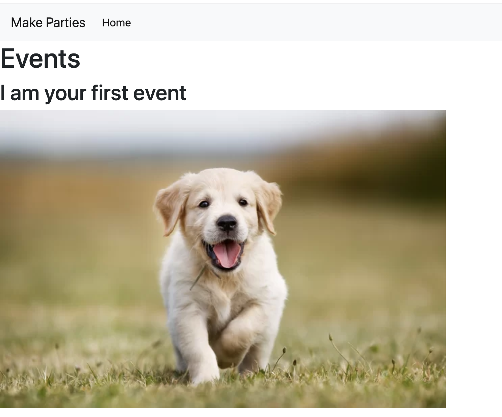
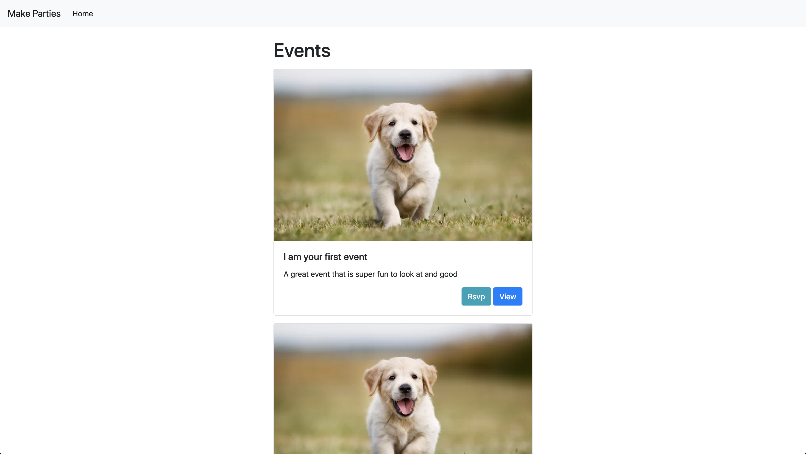

Now that you have the user's experience mapped out and the functionality built, you can style your pages using Twitter's project [Bootstrap](http://getbootstrap.com/). Bootstrap is the web's most popular **Design System**.

The main elements we will be using are the...

- Grid
- Navbar
- Forms
- Inputs
- Buttons

There is a lot more that you can explore and even extend and modify.

# Adding Bootstrap with a Content Delivery Network (CDN)

It is easy to get started with bootstrap quickly by using the CDN links that bootstrap maintains.

We'll add the `<link>` to bootstrap's css in our `<head>` tag in the `views/layouts/main.handlebars` file. And although we aren't going to use any of bootstrap's JavaScript's components, for completeness's sake, we'll put the JavaScript `<script>` tag just before the closing `</body>` tag.

> [info]
>
> You should always reference the [latest Bootstrap CDN links](https://www.bootstrapcdn.com/) and use those to make sure everything is up to date.

<!-- -->

> [action]
> Add the following `<link>` and `<script>` tags to `views/layouts/main.handlebars`:
>
```html
<!-- views/layouts/main.handlebars -->
>
<!doctype html>
<html>
<head>
  <meta charset="utf-8">
  Make Parties
  <!-- Latest compiled and minified CSS -->
  <link rel="stylesheet" href="https://stackpath.bootstrapcdn.com/bootstrap/4.3.1/css/bootstrap.min.css">
</head>
<body>
>
  {{{body}}}
>
  <!-- Latest compiled and minified JavaScript -->
  <script src="https://stackpath.bootstrapcdn.com/bootstrap/4.3.1/js/bootstrap.min.js"></script>
</body>
</html>
```

Just after doing that, refresh your page. The typography and layout should change just a tiny bit if it worked.

# Adding a Navbar

Add the most common navigational component - a top navbar. We'll have it contain a button to create a new event so that anywhere a user navigates to, they can always make a new event. If you shrink and grow the size of your browser window you'll notice that this is a **responsive** navbar, meaning it responds to the size of the screen.

To do this, we need to make a new **partial**. Partials are like html components that you can reuse in multiple views. They only contain enough html to render the component, hence why they're called a "partial".

> [action]
> Create a new folder `views/partials`, and then create a new file `navbar.handlebars` in that `views/partials` directory.
>
> Now add the following code to `views/partials/navbar.handlebars`
>
```html
<nav class="navbar navbar-expand-lg navbar-light bg-light">
  <a class="navbar-brand" href="#">Make Parties</a>
>
  <button class="navbar-toggler" type="button" data-toggle="collapse" data-target="#navbarSupportedContent" aria-controls="navbarSupportedContent" aria-expanded="false" aria-label="Toggle navigation">
    <span class="navbar-toggler-icon"></span>
  </button>
>
  <div class="collapse navbar-collapse">
    <ul class="navbar-nav mr-auto">
      <li class="nav-item active">
        <a class="nav-link" href="/">Home</a>
      </li>
    </ul>
  </div>
</nav>
```

Great, now we need to add it to our `main` layout so that all pages will have it! We'll use Handlebar's `{{> partial}}` syntax to inject the partial we just made into our main template.

> [action]
>
> Update `views/layouts/main.handlebars` to include the `navbar`:
>
```html
...
<body>
>
  {{> navbar}}
>
  {{{body}}}
 ...
```

If you refresh your browser, you should see the following:



# Adding a Grid Container

People argue about the usefulness of some of the more complex parts of Bootstrap, but everyone agrees that to build websites you need a grid system.

Bootstrap ships with a 12-column grid. Meaning you can break up the whole page, or any element into 12 columns and construct an appealing layout.

> [action]
>
> Start by updating `views/layouts/main.handlebars` by wrapping the `{{{body}}}` with a `container` class.

```html
<!-- views/layouts/main.handlebars -->
...
<body>
  ...
  <div class="container">
    {{{body}}}
  </div>
...
```

Refresh and see that this gives us some satisfying gutters on the sides of the page. If we change the screen size by resizing the window, we'll see that these gutters vanish when our screen shrinks beyond a certain size. This is because Bootstrap's grid system is **Responsive**. This means that it _changes depending on the size of the screen that is being shown on._ Pretty neat!

# Adding a Responsive Grid with Cards

Let's add some bootstrap to make things look better. First we'll wrap things in a `row` (with a `margin-top` utility class) and some responsive columns so the events sit in the middle 6 columns of the page when the browser window is `lg` (large).

> [action]
>
> Update `views/events-index.handlebars` to the following:

>```html
  <!-- events-index -->
  <div class="row mt-4">
      <div class="col-lg-6 offset-lg-3">
          <h1>Events</h1>
          {{#each events}}
              <h2>{{this.title}}</h2>
              
              <p>{{this.description}}</p>
          {{/each}}
      </div>
  </div>
>```

Next we'll add some Bootstrap Card enhanced html inside of the `#each`:

> [action]
>
> Update the inside of the `#each` in `views/events-index.handlebars` to the following:

> ```html
  {{#each events}}
    <div class="card mt-3">
      
      <div class="card-body">
        <h5 class="card-title">{{this.title}}</h5>
        <p class="card-text">{{this.desc}}</p>
        <div class="text-right">
          <a href="#" class="btn btn-info">Rsvp</a>
          <a href="#" class="btn btn-primary">View</a>
        </div>
      </div>
    </div>
  {{/each}}
>```

# Product So Far

Looks a lot nicer now, doesn't it?



Great work! Now let's actually build out those events!

# Now Commit

```bash
$ git add .
$ git commit -m 'Added vanilla bootstrap'
$ git push
```
