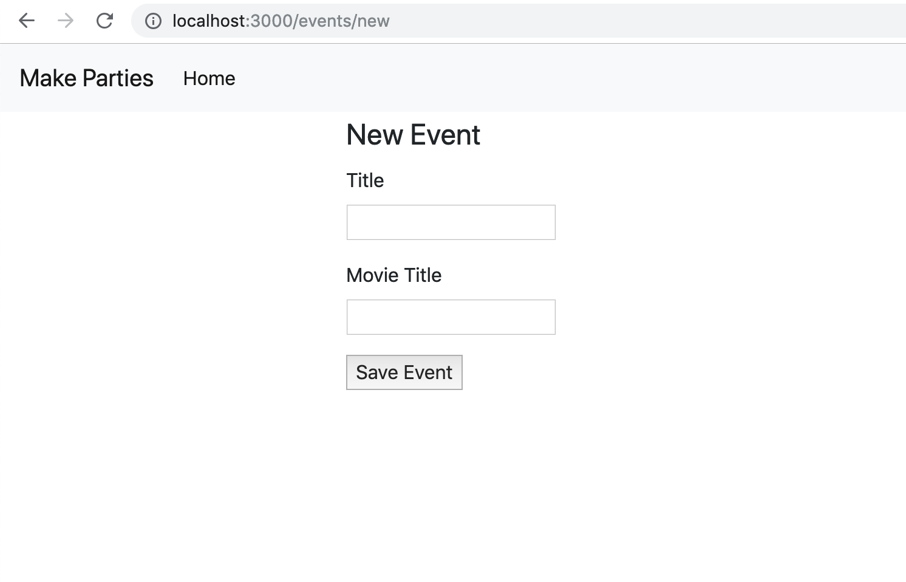
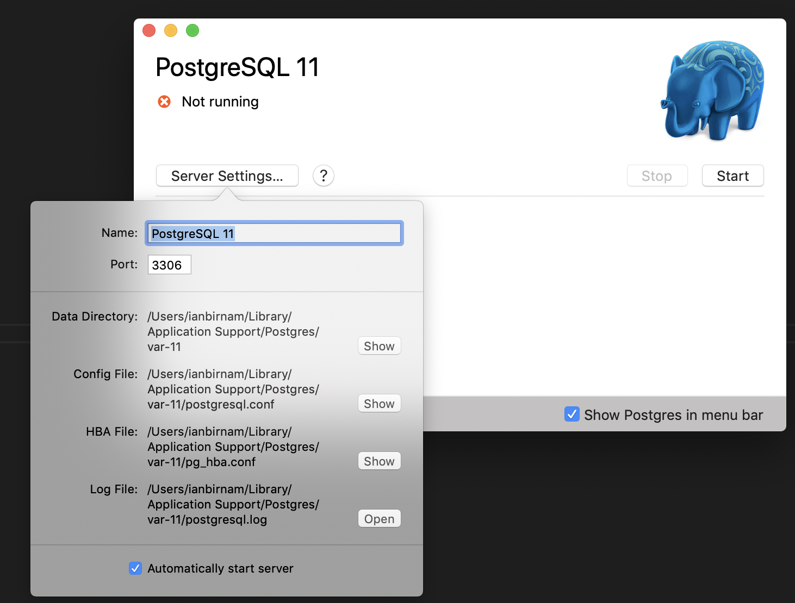

Remember we are doing Resourceful and RESTful architecture to our MVC structured app. We've made some views in the `views` folder, instantiated a (fake) model, and put our controller logic (our routes) into the `app.js` file. As our model and controller logic grows, we can move them into other files. For this app it is so simple, that we'll just leave all that logic in the `app.js` file.

As for the **Resourceful Routes**, we've created just one: the index action for our `Event` resource.

Remember the previous table that showed a hypothetical set of routes for services like Instagram?

Here it is again for event:

| URL              | HTTP Verb | Action  |
|------------------|-----------|---------|
| /events          | GET       | index   |
| /events/new      | GET       | new     |
| /events          | POST      | create  |
| /events/:id      | GET       | show    |
| /events/:id/edit | GET       | edit    |
| /events/:id      | PATCH/PUT | update  |
| /events/:id      | DELETE    | destroy |

What do the routes look like for the app your are currently building?

| URL              | HTTP Verb | Action  |
|------------------|-----------|---------|
| /                | GET       | index   |

Now we want to create two more for the `new` action, and the `create` action.

| URL              | HTTP Verb | Action  |
|------------------|-----------|---------|
| /                | GET       | index   |
| /events/new     | GET       | new     |
| /events         | POST      | create  |


# Linking to New Event Route

First things first - what does the user see?

The user will have to click "New Event" to create a new event. So let's put a link into the `events-index` template.

> [action]
>
> Add the following `<h1>` and `<a>` into `views/events-index.handlebars`:
>
```html
<!-- views/events-index.handlebars -->
<div class="row mt-4">
    <div class="col-lg-6 offset-lg-3">
        <!-- Add the following two lines -->
        <h1>Reviews</h1>
        <a href="/events/new">New Event</a>
>
        <h1>Events</h1>
        {{#each events}}
        ...
        {{/each}}
    </div>
</div>
```

When you click this link you should see a friendly error reminding you that we haven't made the route for `/events/new` yet.

Remember that errors are not bad. They are like sign posts that tell you what to do next. So let's add our route to this new path.

# New Event Form

Now we have to make a route to the `/events/new` path, and have it render a `events-new` template.

> [action]
>
> Add the following route to `app.js` to handle `/events/new`:
>
```js
// NEW
app.get('/events/new', (req, res) => {
  res.render('events-new', {});
})
```

If we navigate our browser to `/events/new` we'll get a friendly little error reminding us that we don't have a template called `events-new.handlebars` yet. So let's put that into our `views` folder.

> [action]
>
> Create the `views/events-new.handlebars` and add the following code to it:
>
```html
<!-- views/events-new.handlebars -->
>
<form method="POST" action="/events">
  <fieldset>
    <legend>New Event</legend>
    <!-- TITLE -->
    <p>
      <label for="title">Title</label><br>
      <input type="text" name="title" />
    </p>
    <p>
      <label for="desc">Movie Title</label><br>
      <input type="text" name="desc" />
    </p>
  </fieldset>
>
  <!-- BUTTON -->
  <p>
    <button type="submit">Save Event</button>
  </p>
>
</form>
```

<!-- -->

> [info]
> Notice a few things about our form. The form tag has an HTML attribute called `action` that has a value equal to the path we want our form to submit its data to. `/events` is the route to our create action that we will add to our server in the next step.

Now if you navigate to `/events/new` you should see our new form looking great:



# Event Create Action

If you try to submit our form now, we see the form sends a **POST** request to the url `/events`, but we have not made a route that detects post requests to that path. So we see our friendly error:

```
cannot POST to /events
```

Our server has no route called `/events` that accepts a POST HTTP method. So let's make one!

First, you need to get ready to accept form data using an npm module called [body-parser](https://expressjs.com/en/resources/middleware/body-parser.html).

> [action]
>
> Install `body-parser`:
>
```bash
$ npm install body-parser
```

Body Parser is a module that allows express to see form data that is coming in from a POST request. So we'll initialize the `body-parser` module in our `app.js` file.

> [action]
>
> Initialize the `body-parser` module in our `app.js` file:
>
```js
// app.js
...
// INITIALIZE BODY-PARSER AND ADD IT TO APP
const bodyParser = require('body-parser');
>
...
// The following line must appear AFTER const app = express() and before your routes!
app.use(bodyParser.urlencoded({ extended: true }));
>
...
// CREATE
app.post('/events', (req, res) => {
  console.log(req.body);
})
```

`body-parser` gives us a new attribute of the `req` object called `req.body` and this will contain the form data. So when you submit your form you should see it log in in your terminal like this:

```
{ title: 'Creating a Event',
  desc: 'a sample event description' }
```

This is great, we're seeing the form data, but now we need to save this data to the database...

# Setting up SQL

SQL—pronouced _ess-queue-el_ or _see-quell_— is a kind of database and the name of the language used to query SQL databases.

For the purpose of this tutorial, we'll be using the **PostgreSQL** database—pronounced _post-gres-queue-el_.

We won't be writing an SQL queries though, because we are going to use an **Object Relationship Mapper (ORM)** to handle our queries for us. We will be using the most popular JavaScript SQL ORM called **Sequelize.**

Since Sequelize's documentation is notoriously bad, refer to this alternative documentation we've written called [Sequelize-It](https://ajbraus.github.io/sequelize-it).

Our first step to setup a database is to add PostgreSQL to our environment.

## Cloud9

If you have Cloud9 PostgreSQL is already installed and you can do the following to start your database.

> [action]
>
> Run the following command:
>
```bash
$ sudo service postgresql start
```

## Computer

If you are running your development environment on your computer, you'll have to install Postgres.

> [action]
>
> 1. Follow the steps outlined at [Postgres.app](https://postgresapp.com/) to get everything set up.
> **Note:** Once you've installed, make sure to close/reopen your terminal for the changes to take effect.
>
> 2. Now use `$ brew install postgresql` in your terminal to finish installing

# Setting up Sequelize on your Project

Cool, Postgres installed, now we gotta work on Sequelize:

> [action]
>
> Follow the "Quick Start: Getting Connected" section in the [Sequelize-It](https://ajbraus.github.io/sequelize-it/#/?id=quick-start-getting-connected) documentation.
>
> **IMPORTANT NOTE 1:** It's very important to follow all 8 steps in the Quick Start, especially in terms of getting the `config.json` file set up correctly. If you run into `ECONNREFUSED` or `ETIMEDOUT` errors, go back to the guide and make sure you followed all 8 steps correctly.
> **IMPORTANT NOTE 2:** You must install all the sequalize libraries locally, not globally, otherwise they will not work in heroku.
>
> Local: 
> Example: `npm install sequelize sequelize-cli pg pg-hstore`

You will need these packages to be available in both development and in production in heroku.

# Creating your First Model & Migration

A **Model** is like a cookie cutter. You use it to define the attributes and behavior of a resource. Models are also used to interact with a database. We'll use our models every time we want to either save or read something from our database.

A **Migration** is some code we use to define the tables and columns of our SQL database. We always have to define the tables and columns before we try to read or write data to them.

These will make more sense once you start to use them, so hang tight.

Sequelize has a set of **Generators** for creating boilerplate code for models, seeders, and migrations. Let's use one of those generator commands to make our `Event` model and migration

> [action]
>
> Run the following command in your terminal to make the `Event` model and migration:
>
```bash
$ sequelize model:create --name Event --attributes title:string,desc:text
```

This command creates a model file, `db/models/event.js` (Notice it is singular), and a migration file `0984932849328-create-event.js`. That jumble of numbers is actually a date and time signature for the moment it was created. Every migration has one because migrations have to run in order, so they are run in the order of when they were created.

The important parts about are model are just the two attributes and their types: `title:STRING`, `desc:TEXT`. A `STRING` data type in SQL can have 255 bytes, and the `TEXT` data type can have unlimited text.

Later we'll use that `Event.associate` function to associate Rsvps with our event.

Our migration is a bit longer and adds a few other attributes to our Event:

- `id`
- `createdAt`
- `updatedAt`

We'll use the `id` to fetch instances of events, and we'll use `createdAt` and `updatedAt` to order them.

> [action]
<!-- > First make sure your ports match what sequelize is expecting: port **3306**. Not doing this will throw an error when running the next command:
>
>  -->
>
> Start the server back up, and then run the migrations:
>
```bash
$ sequelize db:migrate
```

If you run into errors around `mysql` or `mysql2` not being installed, install them through npm (i.e. `npm install -g mysql2`) and then rerun the migration command.

Starting the migration adds the `Events` table to your database. Now we can save events to the database!

> [info]
> If you are on your own computer, you can download the program [Postico](https://eggerapps.at/postico/) and you can examine and edit your database's contents and structure.

One more step and we can commit our code...
