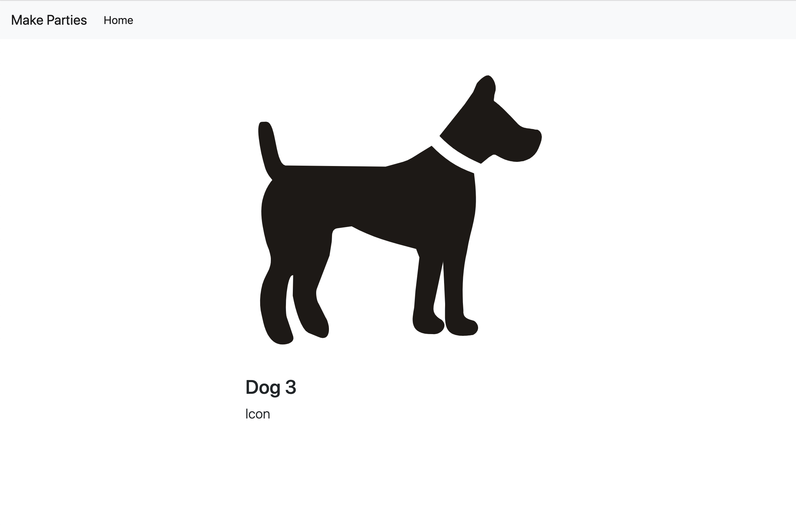

1. ~~Users can view all events (index)~~
1. ~~Users can create a event (new/create)~~
1. **Users can view one event (show)**
1. Users can edit a event (edit/update)
1. Users can delete a event (destroy)
1. Users can rsvp to events (/rsvps/create, /rsvps/new)
1. Users can cancel their rsvp (/rsvps/destroy)


We are building out all the **Resourceful Routes** for our `Event` resource.

| URL              | HTTP Verb | Action  |
|------------------|-----------|---------|
| /                | GET       | index   |
| /events/new     | GET        | new     |
| /events         | POST       | create  |
| /events/:id     | GET        | show    |

We've already completed the index, new, and create actions. Now you will add a show action that will display a single resource via it's `id`.

Now let's setup the **show** action so we give each single event its own page and unique url path.

# Show One Event

Remember, always start by building what the user will see and do. To create the show action, you will want to start by making a link to the event from our index action template. Your route has to follow the `/events/:id` structure.

SQL automatically creates an `id` attribute on anything you save. So we can use that `id` attribute for our `:id` in the route. This is called the **Url or Request Parameter** and we access it in Express using the `req.params` parameter inside a controller route.

> [action]
>
> Add the `View` link in `views/events-index.handlebars` to the following:
>
```html
<!-- views/events-index.handlebars -->
>
...
<a href="/events/{{this.id}}" class="btn btn-primary">View</a>
...
```

What happens if you click on that link? A friendly error! Let's do what it says and make the route.

> [action]
>
> Build the `/show` route in `app.js`:
>
```js
// app.js
>
...
>
// SHOW
app.get('/events/:id', (req, res) => {
  res.send('I\'m an event')
});
```

Now what happens if you go to that route? It should say the text we are sending back. That's good! That means the route is working. Now let's take the next step.

_Taking baby steps like this is a GREAT habit as a software engineer. Aim to take many small steps at a good pace._

# req.params & Event.findByPk()

Ok time to add a template with an actual `event` object! We'll update our `/show` route to find the event we're looking for by its `id` using sequelize's [findByPk](http://docs.sequelizejs.com/class/lib/model.js~Model.html#static-method-findByPk) method, which searches for a single instance by its primary key (which is the event `id`, in this case).

> [action]
>
> Replace your stub `/show` route in `app.js` with the following:
>
```js
// app.js
>
...
>
// SHOW
app.get('/events/:id', (req, res) => {
  // Search for the event by its id that was passed in via req.params
  models.Event.findByPk(req.params.id).then((event) => {
    // If the id is for a valid event, show it
    res.render('events-show', { event: event })
  }).catch((err) => {
    // if they id was for an event not in our db, log an error
    console.log(err.message);
  })
})
```

Now if we go to the route, we'll see the error that no template `events-show` is found. That's great! We knew that didn't exist, so we were expecting this error. The program is working! Let's make the template now.

> [action]
>
> Create a new file `views/events-show.handlebars`, and put the following code in it:
>
```html
<!-- views/events-show.handlebars -->
>

<h1>{{event.title}}</h1>
<h2>{{event.desc}}</h2>

```

Now what do you see? All the `View` links to events should work now!

# Update the Create Action's Redirect

It makes sense from the user's perspective that after we create a new event, we should be automatically redirected to it, no? Let's change our create route to redirect to the show path.

> [action]
>
> Update the `redirect` line in your `/create` route in `app.js` to the following:
>
```js
// CREATE
...
// CREATE
app.post('/events', (req, res) => {
  models.Event.create(req.body).then(event => {
    // Redirect to events/:id
[bold]    res.redirect(`/events/${event.id}`)[/bold]
  }).catch((err) => {
    console.log(err)
  });
})
...
})
```

Try adding a new event now, and make sure it takes you to the `events-show` page after you create it.

# Adding some Bootstrap

Let's make that show template a little prettier with some bootstrap.

We'll wrap it in a responsive row and columns with an offset so its in the middle 6 columns of our container. We'll also add some classes that make the image responsively the full width (`w-100` = width 100%), rounded corners, and a margin bottom level 3. And we'll use the `.lead` class to fancy-up the description text.

> [action]
>
> Update `views/events-show.handlebars` to the following:
>
```html
<div class="row mt-4">
  <div class="col-lg-6 offset-lg-3">
    
    <h3>{{event.title}}</h3>
    <div class="lead">{{event.desc}}</div>
  </div>
</div>
```

# Product so Far

Check out your new event page!



Now let's commit!

# Now Commit

```bash
$ git add .
$ git commit -m 'Users can see single events'
$ git push
```

Now our user experience is getting very smooth, and our code is getting more and more complete. Onward!
