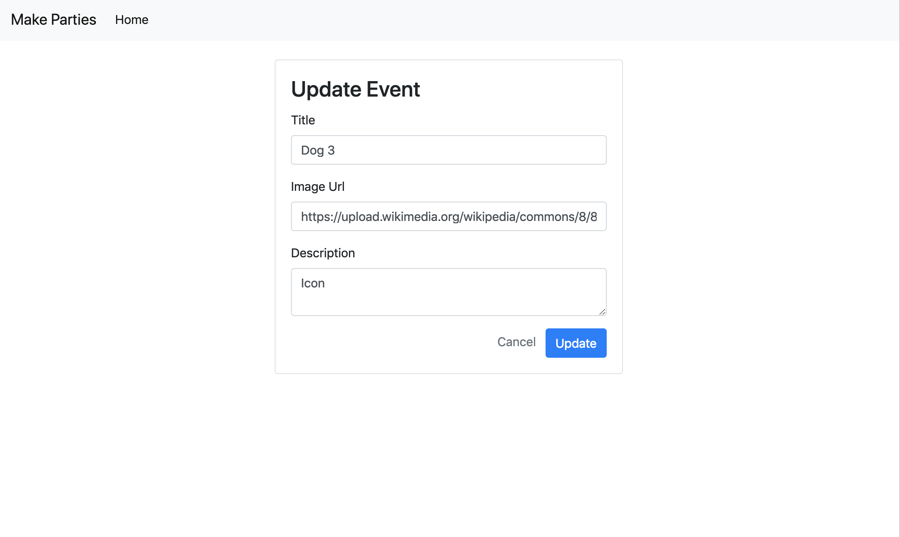
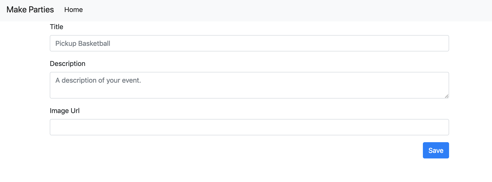

1. ~~Users can view all events (index)~~
1. ~~Users can create a event (new/create)~~
1. ~~Users can view one event (show)~~
1. **Users can edit a event (edit/update)**
1. Users can delete a event (destroy)
1. Users can rsvp to events (/rsvps/create, /rsvps/new)
1. Users can cancel their rsvp (/rsvps/destroy)

Now we're checking off the seven **Resourceful Routes**. But we're not done until all of them are complete.

| URL              | HTTP Verb | Action  |
|------------------|-----------|---------|
| /                | GET       | index   |
| /events/new     | GET       | new     |
| /events         | POST      | create  |
| /events/:id     | GET       | show    |
| /events/:id/edit     | GET       | edit    |
| /events/:id     | PUT/PATCH | update  |

Normally in a site like Eventbrite, we would only want authors of events to have the permission to edit or delete a event. However, because we do not have authentication yet, we're just going to let anyone edit and delete events.

# Edit Link

We want people to be able to edit and update events, let's again start from the user's perspective. Edit and Update are similar to New and Create:

- First we need a link to the edit route that renders a form template called `events-edit`
- Then we submit that edit form to the update route which will redirect to the show action.

So let's make the edit link inside our responsive row and middle 6 columns:

> [action]
>
> Place the edit link directly underneath the `div` for `desc` in `views/events-show.handlebars`:
>
```html
<!-- views/events-show.handlebars -->
>
...
>
    <div class="text-right">
      <a href="/events/{{event.id}}/edit">Edit</a>
    </div>
...
```

Ok now if we click that edit link, we'll see correctly that the route is not found. So let's make our edit action.

The edit action is like the show action because we look up the `event` by its `id` in the url parameter, but then we render the information in a template as editable form elements.

> [action]
>
> Add the `/edit` route in `app.js`:
>
```js
// app.js
>
...
>
// EDIT
app.get('/events/:id/edit', (req, res) => {
  models.Event.findByPk(req.params.id).then((event) => {
    res.render('events-edit', { event: event });
  }).catch((err) => {
    console.log(err.message);
  })
});
```

And of course we'll need that `events-edit` template. This template is a bit weird for three reasons:

1. **`value=""`** - The form needs to display the current values of the event's attributes. We are using the `value` html attribute to pass in the values of the event we are trying to edit.
1. **`<textarea>{{}}</textarea>`** - the `<textarea>` HTML tag does not have a `value` attribute, so its contents must go between its open and close tags.
1. **PUT vs. POST** - Our update action will be expecting a `PUT` HTTP action; however, HTML forms cannot take an action attribute of `PUT` only `POST`. We must find a sensible work around to HTML's shortcomings. We'll use a piece of middleware called `methodOverride` to get the right method. What we'll do is add this middleware and then add `?_method=PUT` onto the end of the action. This way the server will be able to intercept the POST request and set it to PUT and then direct it towards our update action that takes a PUT HTTP request.

Let's start by building out the responsive row and columns

> [action]
>
> Create the `views/events-edit.handlebars` file and add the following code to it:
>
```html
<!-- views/events-edit.handlebars -->
<div class="row mt-4">
  <div class="col-lg-6 offset-lg-3">
>
  </div>
</div>
```
>
> Now add the Card boilerplate inside `<div class="col-lg-6 offset-lg-3">` from above:
>
```html
<div class="card">
  <div class="card-body">
    <div class="card-title">
      <h3>Update Event</h3>
    </div>
    <div class="card-text">
>
    </div>
  </div>
</div>
```
>
> Finally, add the form into the `.card-text` block from above:
>
```html
<form action="/events/{{event.id}}?_method=PUT" method="post">
  <div class="form-group">
    <label for="title">Title</label>
    <input name="title" class="form-control" placeholder="Pickup Basketball" value="{{event.title}}" />
  </div>
  <div class="form-group">
    <label for="imgUrl">Image Url</label>
    <input name="imgUrl" class="form-control" placeholder="" value="{{event.imgUrl}}"/>
  </div>
  <div class="form-group">
    <label for="desc">Description</label>
    <textarea name="desc" class="form-control" placeholder="A description of your event.">{{event.desc}}</textarea>
  </div>
  <div class="text-right">
    <a href="/events/{{event.id}}" class='text-muted mr-2'>Cancel</a>
    <button type="submit" class="btn btn-primary" name="button">Update</button>
  </div>
</form>
```

Here's an example of what the form should look like at this point:



If you submit this form now, it will say there is no POST route to this path. We have to initialize the `methodOverride` middleware to direct this route to the PUT update action.

# Update Route

Remember that you needed to intercept this POST request and make sure its processed as a PUT request so it goes to our update action. (this will work for our delete action later too!). We'll use the [method-override](https://github.com/expressjs/method-override) middleware.

> [action]
>
> install method-override:
>
```bash
$ npm install method-override --save
```

After importing the new package use `require('method-override')` to import it into your project.

> [action]
>
> Now add `methodOverride` as middleware after `const express = require('express')` but before your routes.
>
```js
const express = require('express')
const methodOverride = require('method-override')
>
...
>
const app = express()
>
...
>
// override with POST having ?_method=DELETE or ?_method=PUT
app.use(methodOverride('_method'))
```

Now you can create your update action and it will receive requests with a PUT method.

> [action]
>
> Add the `/update` route to `app.js`:
>
```js
// app.js
...
>
// UPDATE
app.put('/events/:id', (req, res) => {
  models.Event.findByPk(req.params.id).then(event => {
    event.update(req.body).then(event => {
      res.redirect(`/events/${req.params.id}`);
    }).catch((err) => {
      console.log(err);
    });
  }).catch((err) => {
    console.log(err);
  });
});
```

Make sure you're able to edit an event!

# DRY Code & Sub Templates

Did you notice that the code of our `events-new` and `events-edit` have a lot of similarities? Pretty much everything inside the `form` tag is the same. Let's use a **Partial Template** to pull that code out into its own template.

 > [action]
 >
 > Create `views/partials/events-form.handlebars` with the following code:
>
```html
<!-- views/partials/events-form.handlebars -->
>
<div class="form-group">
  <label for="title">Title</label>
  <input name="title" class="form-control" placeholder="Pickup Basketball" value="{{event.title}}" />
</div>
<div class="form-group">
  <label for="desc">Description</label>
  <textarea name="desc" class="form-control" placeholder="A description of your event.">{{event.desc}}</textarea>
</div>
<div class="form-group">
  <label for="imgUrl">Image Url</label>
  <input name="imgUrl" class="form-control" placeholder="" value="{{event.imgUrl}}"/>
</div>
```

And now we can use this partial to replace that information in both our new and edit templates.

> [action]
>
> Update both `views/events-new.handlebars` and `views/events-edit.handlebars` to the following:
>
> **events-new**
>
```html
<!-- views/events-new.handlebars -->
>
<form action="/events" method="post">
  {{> events-form }}
  <div class="text-right">
    <button type="submit" class="btn btn-primary" name="button">Save</button>
  </div>
</form>
...
```
>
> **events-edit**
>
```html
<!-- views/events-edit.handlebars -->
>
<div class="row mt-4">
    <div class="col-lg-6 offset-lg-3">
        <div class="card">
            <div class="card-body">
                <div class="card-title">
                    <h3>Update Event</h3>
                </div>
                <div class="card-text">
                    <form action="/events/{{event.id}}?_method=PUT" method="post">
                        {{> events-form }}
                        <div class="text-right">
                            <a href="/events/{{event.id}}" class='text-muted mr-2'>Cancel</a>
                            <button type="submit" class="btn btn-primary" name="button">Update</button>
                        </div>
                    </form>
                </div>
            </div>
        </div>
    </div>
</div>
```

Triumph! DRY code. (Don't Repeat Yourself). Be sure to test your code though by creating a new event and editing an event to make sure everything still works properly.

**Reminder** - Do not make partials unless the code is very long or repeated. Otherwise you are running the risk of "overengineering" your code.

# Product So Far

Things are really starting to come together! Check out how nice our new event page looks now that we're using our styled partial for the form:



# Now Commit

```bash
$ git add .
$ git commit -m 'Users can edit and update events'
$ git push
```

# Stretch Challenge: "Cancel" buttons

> [challenge]
>
> Sometimes people might start making a resource and then want to cancel. Can you add a "Cancel" button next to the "Save Event" button? What will it do? Where will it link to?
