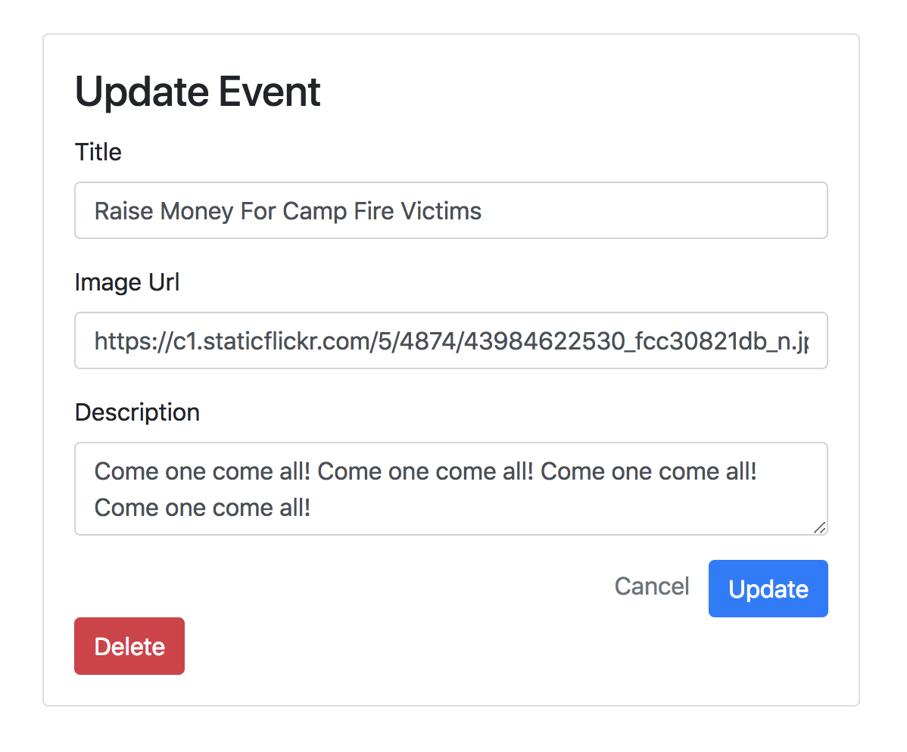

1. ~~Users can view all events (index)~~
1. ~~Users can create a event (new/create)~~
1. ~~Users can view one event (show)~~
1. ~~Users can edit a event (edit/update)~~
1. **Users can delete a event (destroy)**
1. Users can rsvp to events (/rsvps/create, /rsvps/new)
1. Users can cancel their rsvp (/rsvps/destroy)

So we've come to the end of our RESTful and Resourceful routes. Only one to go: Destroy!

| URL              | HTTP Verb | Action  |
|------------------|-----------|---------|
| /                | GET       | index   |
| /events/new     | GET       | new     |
| /events         | POST      | create  |
| /events/:id     | GET       | show    |
| /events/:id/edit     | GET       | edit    |
| /events/:id     | PUT/PATCH | update  |
| /events/:id     | DELETE    | Destroy |

# What the User Sees

As always, we start with what the users sees and does. So let's make a link to delete an event. We'll put it in the edit form so people don't click it accidentally.

We can't set an `<a>` tag's method (it is always GET) so we are going to use a form to submit a DELETE request to our delete action path.

> [action]
>
> Add the following delete form to `views/events-edit.handlebars` following the pre-existing edit form block:
>
```html
<!-- views/events-edit.handlebars -->
...
<form action="/events/{{event.id}}?_method=PUT" method="post">
    ...
</form>
<form action="/events/{{event.id}}?_method=DELETE" method="POST">
  <button type="submit" class='btn btn-danger'>Delete</button>
</form>
...
```

**Careful not to put a form inside another form. Neither will work.**

Your events-edit template should look like this:



But there is no DELETE route, so if you submit this you'll get a helpful error telling you that. So we need a delete action route. After deleting the event, it should redirect to the home page (`events-index`) because the event will be gone.

> [action]
>
> Implement the `/delete` route in `app.js`:
>
```js
// app.js
...
>
// DELETE
app.delete('/events/:id', (req, res) => {
  models.Event.findByPk(req.params.id).then(event => {
    event.destroy();
    res.redirect(`/`);
  }).catch((err) => {
    console.log(err);
  });
})
```

Ok now manually test your destroy action.

We did it! All **Resourceful Routes** for the `Event` resource are complete!

# Now Commit

```bash
$ git add .
$ git commit -m 'Users can destroy events'
$ git push
```

# But Wait!

But there is still one problem. All the event routes are all hanging out in the `app.js` file. This breaks the **Separation of Concerns** principle of clean and **Good Smelling** code. Let's pull out these routes into their own events **Controller**.

# Refactoring and Adding a Controller

> [action]
>
> First make a folder called `controllers`, now add the file `events.js` to this folder.

Our `app.js` file is not aware that there is a controllers folder or a events controller yet. We have to connect them. There are basically two ways to connect this controller to our app:

1. We use the Express Router
1. We use JavaScript's modules system

In this case we are going to use the JavaScript ES5 modules system both to introduce it and to avoid getting into the extra and – at this stage – unnecessary details of the Express Router.

`require` can let you connect any file to any other in JavaScript. All you have to do is put `module.exports` into one file, and then `require(name-of-file)` in the other. Let's look at an example in our controller.

> [action]
>
> Take the `/index` function out from `app.js` and put it into the `controllers/events.js` file:
>
```js
//events.js
>
module.exports = function (app, models) {
>
    // INDEX
    app.get('/', (req, res) => {
        models.Event.findAll({ order: [['createdAt', 'DESC']] }).then(events => {
            res.render('events-index', { events: events });
        })
    })
}
```

Now let's import our events.js file into our app.js file. We'll pass the `app` and our model `Event` into the file as well.

> [action]
>
> Add the following `require` into `app.js`:
>
```js
// app.js
...
>
require('./controllers/events')(app, models);
```

Manually test that you can still navigate to the `events-index` page.

Once you've done that, now we need to do the same for the rest of our routes.

> [action]
>
> Migrate the rest of the events routes into the `controllers/events.js` controller file from `app.js`

Make sure to test all of your functionality to insure that you didn't accidentally break something in the code migration!

Now we have a `views`, `controllers`, and a `db/models` folders, finally getting a clean `app.js` file and the proper separation of concerns!

# Now Commit

```bash
$ git add .
$ git commit -m 'proper separation of concerns'
$ git push
```

# Next Step - Pushing to Heroku

So now it is refactored and all working, let's get this site live by pushing to heroku ... let's work on that next!
