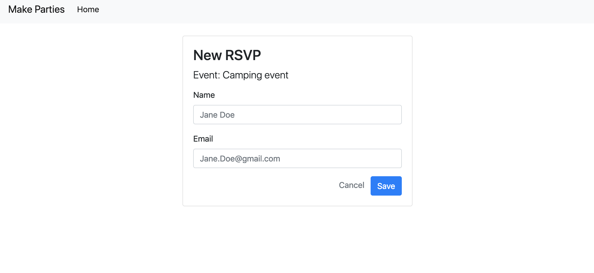
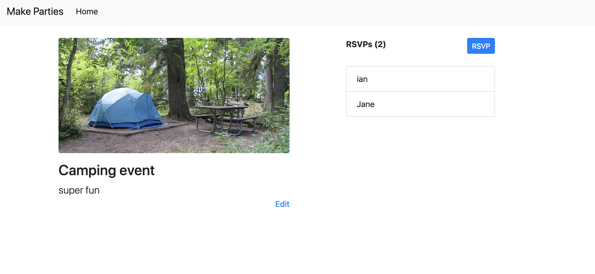

Let's not forget about our **User Stories**

1. ~~Users can view all events (index)~~
1. ~~Users can create a event (new/create)~~
1. ~~Users can view one event (show)~~
1. ~~Users can edit a event (edit/update)~~
1. ~~Users can delete a event (destroy)~~
1. **Users can rsvp to events (/rsvps/create, /rsvps/new)**
1. Users can cancel their rsvp (/rsvps/destroy)

At this point you should have a functioning site that creates and saves Events to a database. This system manages a *single resource*, which we've called a 'Event'. In this section you will add a new resource which will represent Rsvps or reservations to events. We'll call this resource "Rsvps" because "reservations" is very long and annoying to type and can increase the chance of typos.

Rsvps will be treated like Events. They will have a model that defines them, and they will have a table in the database.

Events will "Have Many" Rsvps and Rspvs will "Belong To" Events. And they will have two attributes: `name` and `email`.

# Make the Rsvp Button & rsvps-new Form

Follow the same approach used in the tutorial, start with what users will see. Users looking at an Event may want to rsvp see who has already rsvp'd. Adding rsvps will require a button and then an `rspvs-new` form template to create the rsvp.

> [action]
>
> Let's add an rsvp column on the right. First remove the `offset-lg-3` class on the events column, and then add a button for RSVPS:
>
```html
<!-- views/events-show.handlebars -->
<div class="row mt-4">
  <div class="col-lg-6">
    ...
  </div>
>
  <div class="col-lg-4 offset-lg-1">
    <a href="/events/{{event.id}}/rsvps/new" class="btn btn-primary btn-sm">RSVP</a>
  </div>
>
</div>
```

# Create A Rsvps New Template

Continuing with **Resourceful Routing** we're going to be as resourceful as we can in building our Rsvps. We aren't going to do all seven routes, just three. And notice that these are **Nested Routes** under their parent event:

| URL              | HTTP Verb | Action  |
|------------------|-----------|---------|
| /events/:eventId/rsvps/new     | GET       | new     |
| /events/:eventId/rsvps         | POST      | create  |
| /events/:eventId/rsvps/:id     | DELETE    | Destroy |

So let's start by adding a new controller:

> [action]
>
> Create `/controllers/rsvps.js` and add the following code:
>
```js
// controllers/rsvps.js
>
module.exports = (app, models) => {
  // NEW
  app.get('/events/:eventId/rsvps/new', (req, res) => {
    models.Event.findByPk(req.params.eventId).then(event => {
      res.render('rsvps-new', { event: event });
    });
  });
>
  // CREATE
>
  // DESTROY  
}
```

And remember to require this in your `app.js` next to your other controller

> [action]
>
> Require the new controller in `app.js`:
>
```js
// app.js
>
...
require('./controllers/events')(app, models);
require('./controllers/rsvps')(app, models);
```

Now you can navigate to your rsvps new template using the button...but we still need to make the template!

# New Rsvp Template

> [action]
>
> Let's make our `views/rsvps-new.handlebars` template:
>
```HTML
<!-- views/rsvp-new.handlebars -->
>
<div class="row mt-4">
    <div class="col-lg-6 offset-lg-3">
        <div class="card">
            <div class="card-body">
                <div class="card-title">
                    <h3>New RSVP</h3>
                    <div class="lead">
                        Event: {{event.title}}
                    </div>
                </div>
                <div class="card-text">
                    <form action="/events/{{event.id}}/rsvps" method="post">
                        <div class="form-group">
                            <label for="title">Name</label>
                            <input name="name" class="form-control" placeholder="Jane Doe" />
                        </div>
                        <div class="form-group">
                            <label for="title">Email</label>
                            <input name="email" class="form-control" placeholder="Jane.Doe@gmail.com" />
                        </div>
                        <div class="text-right">
                            <a href="/" class='text-muted mr-2'>Cancel</a>
                            <button type="submit" class="btn btn-primary" name="button">Save</button>
                        </div>
                    </form>
                </div>
            </div>
        </div>
    </div>
</div>
```

Notice you used the same class names and markup used in the Events form. This form only has three form elements. One input for the name of the rsvp, one for email, and a button to submit the form.

Try clicking submit. Uh-oh! No create route (but we expected that!).

# Creating the Rsvp

Now we want to setup our rsvps create action so we have somewhere to submit our form to:

> [action]
>
> Add a `/create` route in `controllers/rsvps.js`:
>
```js
// controllers/rsvps.js
>
...
>
// CREATE
app.post('/events/:eventId/rsvps', (req, res) => {
    models.Rsvp.create(req.body).then(rsvp => {
        res.redirect(`/events/${req.params.eventId}`);
    }).catch((err) => {
        console.log(err)
    });
});
```

If you try to run this (go ahead!), we'll see that this won't work yet because our next step is create a model and SQL db table for rsvps.

# Adding an Rsvp Model

Much like we did for Events, let's create the model and migration for rsvps:

> [action]
>
> Create a new RSVP model using sequelize:
>
```bash
$ sequelize model:create --name Rsvp --attributes name:string,email:string
```

Now we need to run the migration:

> [action]
>
> Run the migration:
>
```bash
$ sequelize db:migrate
```

This creates a model with a `name` and `email` attributes, but no association to the parent Event. If we want these two resources to be associated, then we'll need to associate their tables at the database level.

# Adding an EventId attribute to Rsvps

Remember that Rsvps "Belong To" Events, and Events "Have Many" Rsvps. This is called a **One-To-Many Association**. To establish this we need to add an attribute called `EventId` to the rsvp table.

Sequelize does not have any easy way to do this via migrations, so we are going to do this the hard way.

> [action]
>
> First make a custom migration using the sequelize generator:
>
```bash
$ sequelize migration:create --name add-event-id-to-rsvps
```

Now in the migration, let's add the EventId column then we are going to change the `EventId` column we just created to become a **Foreign Key**—the column that associates one table with another.

> [action]
>
> Update the new `db/migrations/add-event-id-to-rsvps.js` migration file to the following:
>
```js
// migration
>
'use strict';
>
module.exports = {
  up: (queryInterface, Sequelize) => {
    return queryInterface.addColumn(
      'Rsvps', // name of source model
      'EventId', // name of key we are adding
      { 
        type: Sequelize.INTEGER,
        references: { //Required field
          model: 'Events',
          key: 'id'
        },
        onDelete: 'CASCADE',
        onUpdate: 'CASCADE'
      }
    );
  },
>
  down: (queryInterface, Sequelize) => {
    return queryInterface.removeColumn('Rsvps', 'EventId');
  }
};
```

We'll also need to update the Rsvp and Event models to define the "has many" and "belongs to" association:

> [action]
>
> Update the following models to accurately reflect the associations:
>
> **db/models/rsvp.js**
>
```js
// db/models/rsvp.js
...
  Rsvp.associate = function(models) {
    Rsvp.belongsTo(models.Event); // EventId
  };
```
>
> **db/models/event.js**
>
```js
// db/models/event.js
...
  Event.associate = function(models) {
    Event.hasMany(models.Rsvp);
  };
```

# Setting the EventId

Now we need to make sure the `EventId` attribute is set upon creation of an rsvp. We'll do this by updating the `req.body` object before creating the rsvp.

> [action]
>
> Update the `/create` route in `controllers/rsvps.js` to the following:
>
```js
// controllers/rsvps.js
...
>
  // CREATE
  app.post('/events/:eventId/rsvps', (req, res) => {
    req.body.EventId = req.params.eventId;
    models.Rsvp.create(req.body).then(rsvp => {
      res.redirect(`/events/${req.params.eventId}`);
    }).catch((err) => {
        console.log(err)
    });
  });
```

Last step before we can save rsvps is we need to actually run the migration we created!

> [action]
>
> Run the migration!
>
```bash
$ sequelize db:migrate
```

When you save the Rsvp, it should be setting the `EventId` attribute now to the parent event instance. That's good because we'll use that association in our queries going forward.

Test this out yourself:

- Create an RSVP for an event
- Check your DB (using Postico, terminal, etc.) and make sure there is an RSVP table, and you see your rsvp in it

# Fetching and Displaying Rsvps

Now that we've got Rsvps saving and associated with their parent event, we can use some nice sequelize queries to get associated rsvps.

> [action]
>
> In the `events/show` route, update our query to `include` rsvps.
>
```js
// controllers/events.js
>
...
>
// SHOW
app.get('/events/:id', (req, res) => {
    models.Event.findByPk(req.params.id, { include: [{ model: models.Rsvp }] }).then(event => {
        res.render('events-show', { event: event });
    }).catch((err) => {
        console.log(err.message);
    })
});
```

Now in our template we can iterate over `event.Rsvps` to display them. We can also add a little counter of the number of rsvps above:

> [action]
>
> Update the `.col-lg-4 offset-lg-1` block in `views/events-show.handlebars` to the following:
>
```html
<!-- views/events-show.handlebars -->
...
<div class="col-lg-4 offset-lg-1">
    <div class="d-flex justify-content-between">
        <b>RSVPs ({{event.Rsvps.length}})</b>
        <a href="/events/{{event.id}}/rsvps/new" class="btn btn-primary btn-sm">RSVP</a>
    </div>
>
    <div class="list-group mt-4">
        {{#each event.Rsvps}}
        <div class="list-group-item">
            {{this.name}}
        </div>
        {{/each}}
    </div>
</div>
...
```

# One More RSVP Button

We've got almost everything hooked up, but what about that RSVP button on the event cards on the home page? Let's get those wired up too!

> [action]
>
> Update the `<a>` for RSVPs in `views/events-index.handlebars` to the following:
>
```HTML
...
>
<a href="/events/{{this.id}}/rsvps/new" class="btn btn-info">Rsvp</a>
>
...
```

Try out the button, and make sure everything is working!

# Product So Far

Great work! You should now be able to see RSVPs for your event:

**RSVP Form**



**Event Page With RSVPs**



# Now Commit

```bash
$ git add .
$ git commit -m 'Users can see comments'
$ git push
```

# What Just Happened?

You created a relationship between two different tables in your database! Events each have a unique id. By saving the id of an Event with a Rsvp, we can find the Event that they are are associated with. Events can also find all of the Rsvps that are associated with their id.

This is a one to many relationship. This an important concept in database design, and an important tool you will use when managing data.
