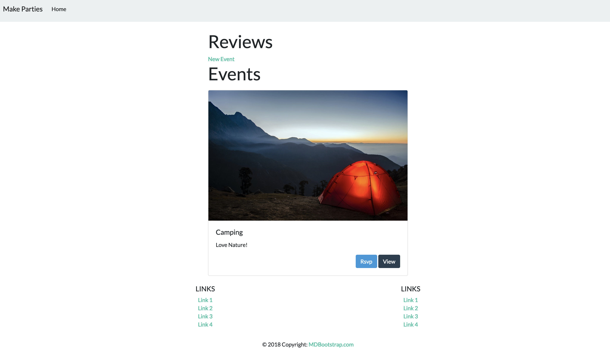
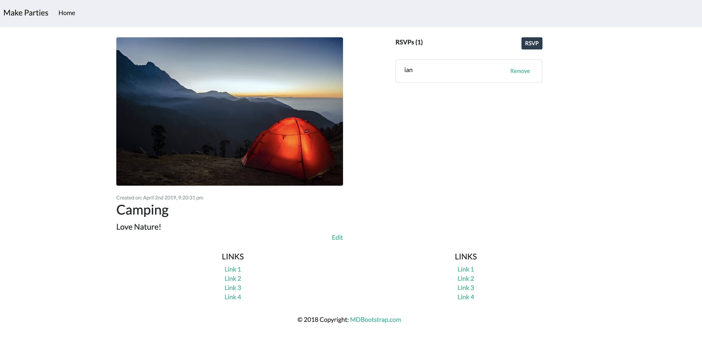

Now there are a few more things we can do to tighten up our website and make it look more like the big leagues. Let's look at a few.

# Displaying "Created At" Time

Let's display a timestamp of when the event was created. Normally this would require some middleware to accomplish our needs, but if you look at the `migration` files, you'll see that all of our models come with a `createdAt` definition by default! Now we just need to display them.

> [challenge]
>
> Update `views/events-show.handlebars` to include the `createdAt` property:
>
```html
<!-- views/events-show.handlebars -->
>
<div class="row mt-4">
    <div class="col-lg-6">
        
[bold]        <small class="text-muted">Created on: {{event.createdAt}}</small>[/bold]
        <h3>{{event.title}}</h3>
        <div class="lead">{{event.desc}}</div>
        <div class="text-right">
            <a href="/events/{{event.id}}/edit">Edit</a>
        </div>
    </div>
>
...
>
</div>
```

Refresh your browser and navigate to an event page. Seems a bit long for a date and time, doesn't it? What you see there is called a Unix timestamp.

```
Mon Nov 26 2018 12:57:54 GMT-0800 (Pacific Standard Time)
```

It technically says the date and time when the review was created, but it isn't very readable for humans! We could parse it manually, but let's use a neat and very common js library called [moment](https://momentjs.com/) to parse that time into something more readable.

> [challenge]
> Install moment
```bash
$ npm install moment --save
```
>
> Now update the `/show` route in `controllers/events.js` to format the `createdAt` date into something we can read:
>
```js
...
>
app.get('/events/:id', (req, res) => {
    models.Event.findByPk(req.params.id, { include: [{ model: models.Rsvp }] }).then(event => {
        let createdAt = event.createdAt;
        createdAt = moment(createdAt).format('MMMM Do YYYY, h:mm:ss a');
        event.createdAtFormatted = createdAt;
        res.render('events-show', { event: event });
    }).catch((err) => {
        console.log(err.message);
    })
});
>
...
```

Reload your browser and check the timestamp. Doesn't that look so much better?

> [info]
> Want it to display differently? Use the [moment documentation](https://momentjs.com/) to tweek the **format string** until you are happy with how the text displays.

# Adding a Footer

Now let's add a footer (Brought to you by mdbootstrap.com).

> [challenge]
>
> Add the following code after the `{{{body}}}` tag, but before the `</body>` tag or any `<script>` tags in `views/layouts/main.handlebars`.
>
```html
<!-- main.handlebars -->
...
>
<!-- Footer -->
<footer class="page-footer font-small blue pt-4">
  <div class="container-fluid text-center">
     <div class="row">
     <hr class="clearfix w-100 d-md-none pb-3">
     <div class="col-md-6 mb-md-0 mb-3">
         <h5 class="text-uppercase">Links</h5>
         <ul class="list-unstyled">
             <li><a href="#!">Link 1</a></li>
             <li><a href="#!">Link 2</a></li>
             <li><a href="#!">Link 3</a></li>
             <li><a href="#!">Link 4</a></li>
         </ul>
     </div>
     <div class="col-md-6 mb-md-0 mb-3">
         <h5 class="text-uppercase">Links</h5>
         <ul class="list-unstyled">
             <li><a href="#!">Link 1</a></li>
             <li><a href="#!">Link 2</a></li>
             <li><a href="#!">Link 3</a></li>
             <li><a href="#!">Link 4</a></li>
         </ul>
     </div>
     </div>
  </div>
  <div class="footer-copyright text-center py-3">© 2018 Copyright:
     <a href="https://mdbootstrap.com/education/bootstrap/"> MDBootstrap.com</a>
  </div>
</footer>
>
...
```

Beautiful! Make any visual changes you like.


# Adding a Bootstrap Theme

Now if we want to customize our style a little bit, we can add a free bootstrap theme. One popular website for finding these is called [Bootswatch](https://bootswatch.com/).

You can pick whichever you like, but for these instructions we'll use the "flatly" theme.

> [challenge]
> Go to [Bootswatch](https://bootswatch.com/) and select a theme from the `Themes` dropdown
>
> Select the dropdown of the name of the style you selected. For example, if you like the `Flatly` style, you should see a `Flatly` dropdown as the last nav bar item on the left
>
> Select the `bootstrap.min.css` option in the dropdown
> Copy the URL into the `<head>` tag in `views/layouts/main.handlebars` to include the style you want. Make sure that this theme comes AFTER your link to bootstrap itself. Otherwise it won't work.
>
```html
<head>
  ...
>
  <link rel="stylesheet" href="https://bootswatch.com/4/flatly/bootstrap.min.css">
</head>
```

Now you can mess around with the CSS classes you have previously applied to achieve the look that you want!.

# Product So Far

Yours may look different depending on the styles/formatting you chose, but it should look similar to this now:

**Home Page**



**Event Page**



# Now Commit

```bash
$ git add .
$ git commit -m 'added createdAt, footer, and bootstrap theme'
$ git push
$ git push heroku master
```
